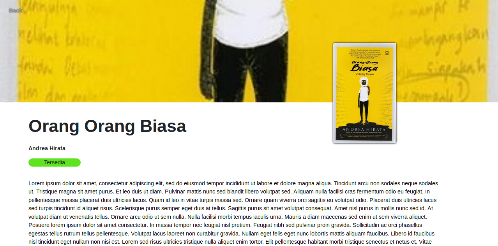
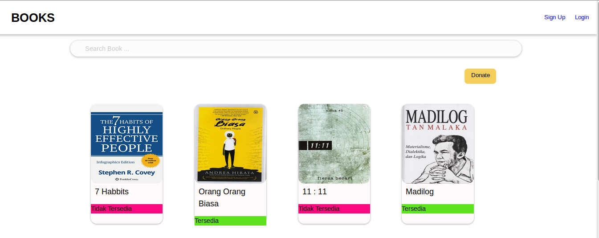
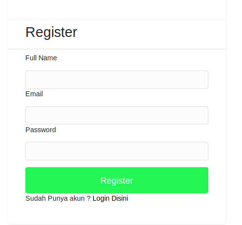
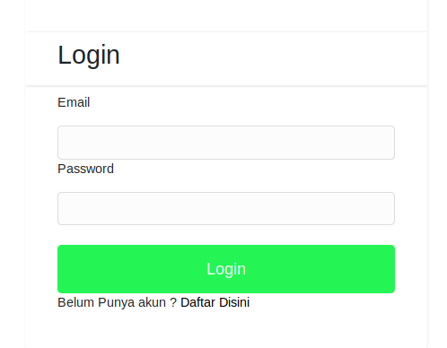
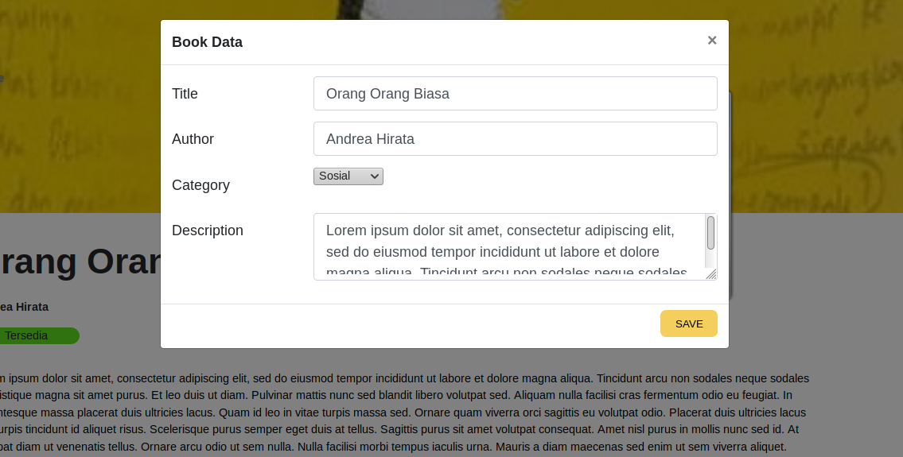

<h1 align="center">LibrarySkuy Web</h1>

  

  Built with ReactJs.

## Table of Contents

- [Introduction](#introduction)
- [Features](#features)
- [Requirements](#requirements)
- [Usage](#usage-for-development)
- [Screenshots](#screenshots)
- [Release web](#release-apk)
- [Contributors](#contributors)

## Introduction
<b>Libraryku</b> is an application to make online book loan transactions based on Web. There are several books with famous authors and can read a brief synopsis by looking at the details of the book

The purpose of this application is for people to borrow books online and easily

## Features
* Users must become member before can loan some books
* Users can loan some books
* Display history loan book
* Forfeit when return book more then date loan
* Donate book
* And others

## Requirements
* [`npm`](https://www.npmjs.com/get-npm)
* [`reactjs`](https://reactjs.org/docs/getting-started.html)

## Usage for development
1. Open your terminal or command prompt
2. Type `git clone https://github.com/ayiangio/frontEndLibrary`
3. Open the folder and type `npm install` for install dependencies
4. Type `npm start` for run this app.

## Screenshots

    
    
    
    
    

## Release Web

## Contributors

  <table>
    <tr>
      <td align="center">
        <a href="https://github.com/andreferi3">
           
          <b>Ayi Angio</b>
        </a>
      </td>
    </tr>
  </table>

